# Fit GPT

AI-powered workout tracking app with intelligent workout plan parsing.

## Project Overview

A full-stack workout tracking application that allows users to:
- Track workouts with exercises, sets, reps, and weights
- Parse AI-generated workout plans into structured, trackable workouts
- Manage workout history and progress

**Core Feature**: AI workout parser that converts unstructured text into interactive workout sessions.

## Workout Parse Flow

The workout parser uses a 5-stage pipeline to convert raw text into structured database entries:

```mermaid
flowchart TD
    Start([POST /api/workouts/parse]) --> Controller[WorkoutParserController]
    Controller --> Orchestrator{Orchestrator<br/>5-Stage Pipeline}

    Orchestrator --> Stage1[Stage 1: PreValidator]
    Stage1 --> ValidateText{Is workout content?<br/>Confidence ≥ 0.7?}
    ValidateText -->|No| Error1[Return 400 Error]
    ValidateText -->|Yes| Stage2[Stage 2: Parser]

    Stage2 --> LLMParse[Claude Sonnet<br/>Extract Structure]
    LLMParse --> ParseOutput[WorkoutWithPlaceholders<br/>exercise names only]
    ParseOutput --> Stage3[Stage 3: IDExtractor]

    Stage3 --> LoopExercises{For each unique<br/>exercise name}
    LoopExercises --> Semantic[Try Semantic Search<br/>threshold: 0.75]
    Semantic --> SemanticMatch{Match found?}

    SemanticMatch -->|Yes| UseID[Use exercise ID]
    SemanticMatch -->|No| AIFallback[Claude Haiku<br/>with Tools]

    AIFallback --> SearchDB[search_exercises]
    SearchDB --> AIDecision{True match?}
    AIDecision -->|Yes| SelectExercise[select_exercise<br/>Use existing ID]
    AIDecision -->|No| CreateExercise[create_exercise<br/>Create new + flag review]

    SelectExercise --> UseID
    CreateExercise --> UseID
    UseID --> MoreExercises{More exercises?}
    MoreExercises -->|Yes| LoopExercises
    MoreExercises -->|No| IDOutput[WorkoutWithResolvedExercises<br/>exercise IDs]

    IDOutput --> Stage4[Stage 4: SyntaxFixer]
    Stage4 --> ValidateSchema{Valid schema?}
    ValidateSchema -->|No| LLMFix[Claude fixes issues<br/>max 3 retries]
    LLMFix --> ValidateSchema
    ValidateSchema -->|Yes| Stage5[Stage 5: DatabaseFormatter]

    Stage5 --> GenUUIDs[Generate UUIDs<br/>workout, blocks, exercises, sets]
    GenUUIDs --> DBReady[Workout Object<br/>Database-ready]

    DBReady --> SaveDB[(WorkoutRepository<br/>Save to Postgres)]
    SaveDB --> ResolveNames[Resolve exercise IDs<br/>to names for response]
    ResolveNames --> Success([200 OK<br/>Return Workout])

    style Start fill:#e8f5e9
    style Success fill:#e8f5e9
    style Error1 fill:#ffebee
    style Stage1 fill:#fff3e0
    style Stage2 fill:#fff3e0
    style Stage3 fill:#fff3e0
    style Stage4 fill:#fff3e0
    style Stage5 fill:#fff3e0
    style LLMParse fill:#e3f2fd
    style AIFallback fill:#e3f2fd
    style LLMFix fill:#e3f2fd
    style SaveDB fill:#f3e5f5
```



**Pipeline Stages:**
1. **PreValidator**: Validates input is workout content (Claude Haiku)
2. **Parser**: Extracts structured workout with exercise names (Claude Sonnet)
3. **IDExtractor**: Resolves exercise names to database IDs via semantic search + AI fallback
4. **SyntaxFixer**: Validates and fixes schema violations
5. **DatabaseFormatter**: Generates UUIDs for all entities

## Demo
https://github.com/user-attachments/assets/c3053c71-e3ac-4912-b793-036ad0869ab9

## Tech Stack

**Backend** (`/backend`)
- Express.js + TypeScript
- PostgreSQL + Kysely
- JWT authentication
- Swagger/OpenAPI docs

**Frontend** (`/frontend`)
- React Native + Expo
- TypeScript
- TanStack Query (React Query)
- React Navigation

## Quick Start

```bash
# Backend
cd backend
npm install
cp .env.example .env  # Configure PostgreSQL connection and JWT secret
npm run dev           # Runs on http://localhost:3000

# Frontend
cd frontend
npm install
npm start            # Expo development server
```

## Directory Structure

```
fit-gpt/
├── backend/                    # Express API server
│   ├── src/
│   │   ├── controllers/        # Route handlers
│   │   ├── db/                # Database connection, types, and schemas
│   │   ├── routes/            # API endpoints (/api/*)
│   │   ├── services/          # Business logic (workout parsing, AI integration)
│   │   ├── middleware/        # Auth, error handling
│   │   ├── types/             # TypeScript definitions
│   │   └── config/            # DB and environment setup
│   ├── tests/                 # Integration and unit tests
│   └── docs/                  # Backend-specific docs (Swagger guide)
│
├── frontend/                   # React Native mobile app
│   ├── src/
│   │   ├── screens/           # Screen components
│   │   ├── components/        # Reusable UI components
│   │   ├── navigation/        # Navigation setup
│   │   ├── api/              # API client and React Query
│   │   ├── contexts/         # React contexts (auth, theme)
│   │   ├── hooks/            # Custom hooks
│   │   ├── types/            # TypeScript definitions
│   │   └── utils/            # Utility functions
│   └── README.md             # Frontend setup guide
```

## Key Locations

### Backend
- **API Routes**: `backend/src/routes/` - Auth, workouts, exercises, users
- **API Docs**: `http://localhost:3000/api-docs` (Swagger UI when running)
- **Database**: `backend/src/db/` - Database connection, types, and schemas
- **Types**: `backend/src/types/` - TypeScript interfaces and types
- **Tests**: `backend/tests/integration/routes/` - Integration tests with PostgreSQL testcontainers

### Frontend
- **Screens**: `frontend/src/screens/` - UI screens
- **API Client**: `frontend/src/api/client.ts` - Axios instance with JWT interceptors
- **Types**: `frontend/src/types/` - TypeScript interfaces matching backend models
- **Navigation**: `frontend/src/navigation/` - React Navigation setup

## API Documentation

Interactive API docs available at `http://localhost:3000/api-docs` when backend is running.

## Testing

```bash
# Run unit tests
cd backend
npm run test:unit

# Run integration tests
cd backend
npm run test:integration

# Run specific test file
npm run test:integration -- tests/integration/<path-to-integration-test>
npm run test:unit -- tests/unit/<path-to-unit-test>

# Type checking
npm run type-check
```

## Environment Setup

**Backend** (`backend/.env`):
- `DATABASE_URL` - PostgreSQL connection string (or use individual `POSTGRES_*` variables)
- `POSTGRES_HOST`, `POSTGRES_PORT`, `POSTGRES_USER`, `POSTGRES_PASSWORD`, `POSTGRES_DB` - PostgreSQL connection details
- `JWT_SECRET` - Secret key for JWT tokens
- `PORT` - API server port (default: 3000)
- `ANTHROPIC_API_KEY` - Anthropic API key

**Frontend** (`frontend/.env`):
- `API_BASE_URL` - Backend API URL (e.g., `http://localhost:3000/api`)
