# Workout Parse Flow

This diagram shows the complete flow of parsing a workout from raw text to a structured database entry.

```mermaid
flowchart TD
    Start([POST /api/workouts/parse]) --> Controller[WorkoutParserController]
    Controller --> Orchestrator{Orchestrator<br/>5-Stage Pipeline}

    Orchestrator --> Stage1[Stage 1: PreValidator]
    Stage1 --> ValidateText{Is workout content?<br/>Confidence ≥ 0.7?}
    ValidateText -->|No| Error1[Return 400 Error]
    ValidateText -->|Yes| Stage2[Stage 2: Parser]

    Stage2 --> LLMParse[Claude Sonnet<br/>Extract Structure]
    LLMParse --> ParseOutput[WorkoutWithPlaceholders<br/>exercise names only]
    ParseOutput --> Stage3[Stage 3: IDExtractor]

    Stage3 --> LoopExercises{For each unique<br/>exercise name}
    LoopExercises --> Semantic[Try Semantic Search<br/>threshold: 0.75]
    Semantic --> SemanticMatch{Match found?}

    SemanticMatch -->|Yes| UseID[Use exercise ID]
    SemanticMatch -->|No| AIFallback[Claude Haiku<br/>with Tools]

    AIFallback --> SearchDB[search_exercises]
    SearchDB --> AIDecision{True match?}
    AIDecision -->|Yes| SelectExercise[select_exercise<br/>Use existing ID]
    AIDecision -->|No| CreateExercise[create_exercise<br/>Create new + flag review]

    SelectExercise --> UseID
    CreateExercise --> UseID
    UseID --> MoreExercises{More exercises?}
    MoreExercises -->|Yes| LoopExercises
    MoreExercises -->|No| IDOutput[WorkoutWithResolvedExercises<br/>exercise IDs]

    IDOutput --> Stage4[Stage 4: SyntaxFixer]
    Stage4 --> ValidateSchema{Valid schema?}
    ValidateSchema -->|No| LLMFix[Claude fixes issues<br/>max 3 retries]
    LLMFix --> ValidateSchema
    ValidateSchema -->|Yes| Stage5[Stage 5: DatabaseFormatter]

    Stage5 --> GenUUIDs[Generate UUIDs<br/>workout, blocks, exercises, sets]
    GenUUIDs --> DBReady[Workout Object<br/>Database-ready]

    DBReady --> SaveDB[(WorkoutRepository<br/>Save to Postgres)]
    SaveDB --> ResolveNames[Resolve exercise IDs<br/>to names for response]
    ResolveNames --> Success([200 OK<br/>Return Workout])

    style Start fill:#e8f5e9
    style Success fill:#e8f5e9
    style Error1 fill:#ffebee
    style Stage1 fill:#fff3e0
    style Stage2 fill:#fff3e0
    style Stage3 fill:#fff3e0
    style Stage4 fill:#fff3e0
    style Stage5 fill:#fff3e0
    style LLMParse fill:#e3f2fd
    style AIFallback fill:#e3f2fd
    style LLMFix fill:#e3f2fd
    style SaveDB fill:#f3e5f5
```

## Flow Summary

### Stages

1. **PreValidator**: Validates input is workout content (Claude Haiku)
2. **Parser**: Extracts structured workout with exercise names (Claude Sonnet)
3. **IDExtractor**: Resolves exercise names to database IDs
   - First tries semantic search (threshold: 0.75)
   - Falls back to AI with tools (search/select/create)
4. **SyntaxFixer**: Validates and fixes schema violations
5. **DatabaseFormatter**: Generates UUIDs for all entities

### Key Features

- **Hybrid Exercise Resolution**: Semantic search + AI fallback
- **Auto-create Exercises**: Creates new exercises with `needsReview: true` flag
- **Validation**: Zod schema validation with AI-powered fixes
- **Safety**: Prompt injection prevention, confidence thresholds

### Models Used

- **Claude Sonnet 4.5**: Complex parsing and structure extraction
- **Claude Haiku 3.5**: Fast classification and tool-based resolution
